<div align="center">

# 操作系统课程设计报告

## MIT 6.1810 xv6 Labs 2025

<br>

| 项目 | 内容 |
|---|---|
| 学院 | 待填写 |
| 专业班级 | 待填写 |
| 姓名 | 待填写 |
| 学号 | 待填写 |
| 组号 | 待填写 |
| 指导教师 | 王老师 |
| 完成日期 | 2026 年 8 月 |

</div>

> 本 Markdown 是最终上交文档的唯一源稿。实验完成后应填入真实实现、测试与分析，再导出为带阅读导航的 Word 或 PDF。文中的“待填写”和编辑注释在导出前必须清理。

---

## 摘要

<!-- 最后撰写，约 300—500 字：背景、完成范围、核心方法、最终结果和主要收获。 -->

待填写。

**关键词：** xv6；RISC-V；操作系统；系统调用；虚拟内存；文件系统

---

## 目录

- [1. 项目概述](#1-项目概述)
- [2. 开发环境、工具与调试方法](#2-开发环境工具与调试方法)
- [3. Lab util：Unix utilities](#3-lab-utilunix-utilities)
- [4. Lab syscall：System calls](#4-lab-syscallsystem-calls)
- [5. Lab pgtbl：Page tables](#5-lab-pgtblpage-tables)
- [6. Lab traps：Traps](#6-lab-trapstraps)
- [7. Lab cow：Copy-on-write](#7-lab-cowcopy-on-write)
- [8. Lab net：Network driver](#8-lab-netnetwork-driver)
- [9. Lab lock：Locking](#9-lab-locklocking)
- [10. Lab fs：File system](#10-lab-fsfile-system)
- [11. Lab mmap：Memory mapping](#11-lab-mmapmemory-mapping)
- [12. 综合分析](#12-综合分析)
- [13. 总结与心得](#13-总结与心得)
- [14. 参考资料](#14-参考资料)
- [15. 源码仓库与提交记录](#15-源码仓库与提交记录)
- [附录](#附录)

---

## 1. 项目概述

### 1.1 项目背景

xv6 是一个面向教学的 Unix 风格操作系统。本项目以 MIT 6.1810 2025 版 xv6 Labs 为基础，通过阅读内核源码、完成实验任务和分析运行结果，理解进程、系统调用、页表、中断与异常、并发控制及文件系统等核心机制。

### 1.2 项目目标

- 掌握 xv6 的编译、启动、测试和调试流程。
- 理解用户程序到内核服务的完整调用链。
- 理解虚拟内存、陷阱、网络、锁和文件系统的核心实现。
- 通过手工测试、局部评分和完整评分验证实现正确性。

### 1.3 项目分工

<!-- 个人项目说明独立完成范围；小组项目列出各成员的真实工作。 -->

待填写。

### 1.4 完成情况总览

| Lab | 主题 | 实现状态 | `make grade` | 报告状态 |
|---|---|---|---|---|
| util | Unix utilities | 已完成 | 131/131 | 已完成 |
| syscall | System calls | 已完成 | 45/45 | 已完成 |
| pgtbl | Page tables | 已完成 | 41/41 | 已完成 |
| traps | Traps | 已完成 | 95/95 | 已完成 |
| cow | Copy-on-write | 未开始 | — | 未开始 |
| net | Network driver | 未开始 | — | 未开始 |
| lock | Locking | 未开始 | — | 未开始 |
| fs | File system | 未开始 | — | 未开始 |
| mmap | Memory mapping | 未开始 | — | 未开始 |

> 状态必须随实际进度更新，未完成的实验不得写成已完成。

## 2. 开发环境、工具与调试方法

### 2.1 开发环境

| 组件 | 实际版本 | 用途 |
|---|---|---|
| Windows + WSL 2 | 待记录 | 宿主和 Linux 开发环境 |
| Ubuntu | 24.04 | 执行 Git、Make 和评分脚本 |
| RISC-V GCC | 待记录 | 交叉编译 xv6 |
| QEMU | 待记录 | 模拟 RISC-V 硬件 |
| VS Code (WSL) | 待记录 | 源码阅读和编辑 |

### 2.2 环境安装与验证

<!-- 只保留关键安装步骤、版本验证和一张启动截图，不粘贴整段安装日志。 -->

```bash
qemu-system-riscv64 --version
riscv64-linux-gnu-gcc --version
cd ~/xv6-labs-2025
make qemu
```

待补入实际验证结果。

### 2.3 仓库与分支管理

项目使用双远程结构：`mit` 保留 MIT 官方实验分支，`origin` 保存个人实现和报告。各 Lab 在对应分支开发，以便将实现与官方基线进行比较。

### 2.4 通用调试方法

1. 先阅读第一条编译错误，再处理后续连锁报错。
2. 使用 `printf` 和最小测试用例缩小问题范围。
3. 使用 `addr2line`、`kernel.asm` 和 GDB 分析 panic 或卡死。
4. 先运行局部测试，最后从干净编译状态运行 `make grade`。

### 2.5 环境问题与解决方法

| 现象 | 定位方法 | 根本原因 | 解决方法 | 验证结果 |
|---|---|---|---|---|
| 待填写 | 待填写 | 待填写 | 待填写 | 待填写 |

## 3. Lab util：Unix utilities

### 3.1 实验概述

| 项目 | 内容 |
|---|---|
| 官方分支 | `util` |
| 实验主题 | xv6 用户程序、文件 I/O、C 内存表示、目录遍历和进程控制 |
| 具体任务 | `sleep`、`sixfive`、`memdump`、`find`、`find -exec` |
| 基线提交 | `db9a9d8` |
| 完成提交 | `5493306` |
| 实际用时 | 6 小时 |
| 最终评分 | 131/131 |

本 Lab 的任务集合与旧版 xv6 Lab 不同。开发前先对照 2025 官方页面、本地 `grade-lab-util` 和当前分支文件，确定了真实任务及评分边界，再按一个功能一个 Git 检查点的方式实现。

### 3.2 sleep：用户级延时程序

#### 3.2.1 实验目的

实现用户级 `sleep` 命令，将命令行中的 ticks 参数转换为整数，并调用 xv6 2025 版已提供的 `pause()` 系统调用暂停当前进程。

#### 3.2.2 原理与调用链

```text
shell 解析 sleep 10
  → main(argc, argv)
  → atoi(argv[1])
  → pause(ticks) 用户态桩
  → sys_pause()
  → 根据时钟中断更新的 ticks 休眠与唤醒
```

2025 版的内核入口是 `sys_pause`，不是旧版报告常见的 `sys_sleep`。`kernel/sysproc.c`、`user/user.h` 和系统调用桩均已存在，因此本任务只需增加用户程序，无需修改内核。

#### 3.2.3 设计与实现

| 文件 | 修改 | 作用 |
|---|---|---|
| `user/sleep.c` | 新建用户程序 | 验证参数、转换 ticks、调用 `pause()` |
| `Makefile` | 在 `UPROGS` 中加入 `_sleep` | 将程序编译并写入 xv6 文件系统镜像 |

```c
if(argc != 2){
  fprintf(2, "usage: sleep ticks\n");
  exit(1);
}
pause(atoi(argv[1]));
exit(0);
```

参数数量必须精确为 1，避免读取不存在或多余的参数。无参数运行时向标准错误输出用法，并以非零状态退出。

#### 3.2.4 实验结果与分析

| 测试 | 结果 |
|---|---|
| 无参数运行 | 输出 `usage: sleep ticks` 并正常返回 shell |
| `sleep 10` | 暂停约 10 ticks 后返回 shell |
| `./grade-lab-util sleep` | 3/3 测试通过，包括断点验证 `sys_pause` 被调用 |

评分脚本不仅检查程序是否返回，还在 `sys_pause` 设置断点，因此全部通过说明程序确实进入了要求的系统调用，而不是用空循环模拟延时。

### 3.3 sixfive：文本文件中的数字筛选

#### 3.3.1 实验目的

使用 `open()` 和 `read()` 逐字符读取一个或多个文件，识别由官方指定分隔符包围的十进制数字，输出能被 5 或 6 整除的值。

#### 3.3.2 解析设计

实现使用三个状态量：

- `valid`：当前 token 是否仍由纯数字构成；
- `have_digits`：当前 token 是否至少读到一个数字；
- `value`：按十进制累积的数值。

遇到空格、减号、回车、制表符、换行、点、斜杠、逗号或 EOF 时结算 token。如果 token 中出现其他非数字字符，则整个 token 无效，直到下一分隔符才重置。这保证了 `06` 会作为数值 6 输出，而 `xv6` 中的字符 `6` 不会被误识别。

#### 3.3.3 实现与结果

| 文件 | 修改 | 作用 |
|---|---|---|
| `user/sixfive.c` | 新建逐字符解析程序 | 处理 token、整除判断、多文件和错误路径 |
| `Makefile` | 在 `UPROGS` 中加入 `_sixfive` | 将程序加入镜像 |

```text
$ sixfive sixfive.txt README
5
100
18
6
6
6
1810
6
1810
```

<div align="center">
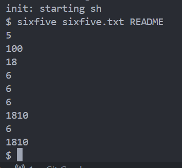
<br>图 3-1 sixfive 对 sixfive.txt 和 README 的多文件处理结果
</div>

`./grade-lab-util sixfive` 中的 `sixfive_test`、`sixfive_readme` 和 `sixfive_all` 均通过，分别验证了基本数字解析、文本内嵌数字边界和多文件顺序处理。

### 3.4 memdump：按格式解释连续内存

#### 3.4.1 实验目的

实现 `memdump(char *fmt, char *data)`，理解 C 语言中整数、字符、指针、结构体对齐和字符串在连续内存中的表示。

#### 3.4.2 格式字符与指针推进

| 格式 | 解释方式 | `data` 推进 |
|---|---|---:|
| `i` | 32 位有符号整数，十进制 | 4 字节 |
| `p` | 64 位数值，十六进制 | 8 字节 |
| `h` | 16 位有符号整数，十进制 | 2 字节 |
| `c` | 8 位 ASCII 字符 | 1 字节 |
| `s` | 当前 8 字节保存的字符串指针 | 8 字节 |
| `S` | 当前位置的 NUL 结尾内联字符串 | 字符串长度 + 1 |

多字节字段没有直接将 `char *` 强制转换后解引用，而是先使用 `memmove` 复制到正确类型的局部变量。这样既使字节宽度明确，也避免了未对齐地址的直接访问。

#### 3.4.3 实验结果与分析

<div align="center">
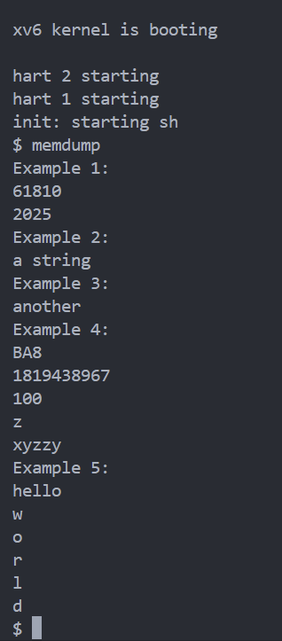
<br>图 3-2 memdump 对整数、指针、字符和字符串的解析结果
</div>

内置五组示例全部得到预期输出。图 3-2 中 Example 4 的首行是运行时指针值，具体地址每次可能不同，不影响正确性。`./grade-lab-util memdump` 的内置示例和标准输入组合两项测试均通过。

### 3.5 find：递归查找目录树

#### 3.5.1 实验目的与调用链

实现简化版 Unix `find`，使用 xv6 的文件和目录系统调用递归查找指定名称的文件。

```text
open(path)
  → fstat(fd, &st)
  ├─ T_FILE：取路径最后一段，使用 strcmp() 匹配
  └─ T_DIR：read(fd, &dirent, sizeof(dirent))
       → 构造子路径
       → 递归 find(child, name)
```

#### 3.5.2 设计与实现

| 关键点 | 处理方式 |
|---|---|
| 目录项名称 | 复制固定长度 `DIRSIZ` 后显式补 `\0` |
| 递归循环 | 跳过 inode 为 0 的目录项及 `.`、`..` |
| 路径匹配 | 提取最后一段后使用 `strcmp()`，不使用指针 `==` |
| 路径安全 | 在 512 字节缓冲区中追加目录项前检查长度 |
| 资源管理 | 打开或 `fstat` 失败时报错，所有返回路径正确 `close(fd)` |

`./grade-lab-util 'find, in' 'find, recursive'` 验证了当前目录、指定子目录和多层递归三种情况，全部通过。

### 3.6 find -exec：对匹配文件执行命令

#### 3.6.1 实验目的

在不破坏基础 `find path name` 行为的前提下，支持：

```text
find path name -exec command [args ...]
```

对每个匹配文件，实际执行“`command`、原命令参数、匹配路径”。

#### 3.6.2 进程控制与参数构造

```text
文件名匹配
  → 复制 -exec 后的原参数
  → 追加匹配文件路径
  → fork()
     ├─ 子进程：exec(argv[0], argv)
     └─ 父进程：wait(0)
```

参数数组使用 `kernel/param.h` 中的 `MAXARG` 作为上限，并为追加的匹配路径和末尾空指针预留位置。父进程等待子进程结束，使多个匹配文件的命令输出保持可预期顺序。

#### 3.6.3 回归测试与分析

<div align="center">
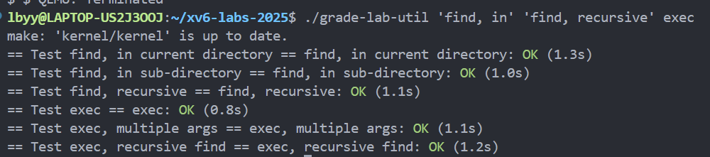
<br>图 3-3 find 与 find -exec 的六项回归测试
</div>

图 3-3 同时运行了三项基础 `find` 和三项 `exec` 测试，全部为 `OK`。这说明执行扩展没有改变原有查找语义，同时支持单参数、多参数和递归目录中的命令执行。

### 3.7 关键问题与处理

| 所属任务 | 问题/风险 | 原因 | 处理与验证 |
|---|---|---|---|
| sleep | 旧资料使用 `sleep()`，当前任务要求 `pause()` | 2025 版重命名了用户和内核入口 | 以官方页面和本地 `sys_pause` 为准；断点评分通过 |
| sixfive | `xv6` 中的 `6` 不应当作数字 | 非分隔符字母会使整个 token 无效 | 增加 `valid` 状态；README 边界测试通过 |
| memdump | 将 `char *` 直接转成多字节指针可能未对齐 | 输入指针按 1 字节推进 | 使用 `memmove` 读入对齐局部变量；全部格式测试通过 |
| find | `dirent.name` 不保证是普通 C 字符串 | 目录项使用固定长度 `DIRSIZ` | 复制后显式补 `\0`，再比较 `.`、`..` 和目标名 |
| find -exec | 执行参数还需追加文件路径 | 空指针结尾和 `MAXARG` 都占用边界 | 执行前检查数量并显式结尾；多参数评分通过 |

### 3.8 最终验收

完成所有任务后，在仓库根目录创建 `time.txt`，填写实际用时 6 小时。随后从干净编译状态运行：

```bash
make clean
make grade
```

| 验收项 | 结果 |
|---|---|
| sleep | 3 项通过 |
| sixfive | 3 项通过 |
| memdump | 2 项通过 |
| find | 3 项通过 |
| find -exec | 3 项通过 |
| time | 通过 |
| 最终总分 | **131/131** |

<div align="center">
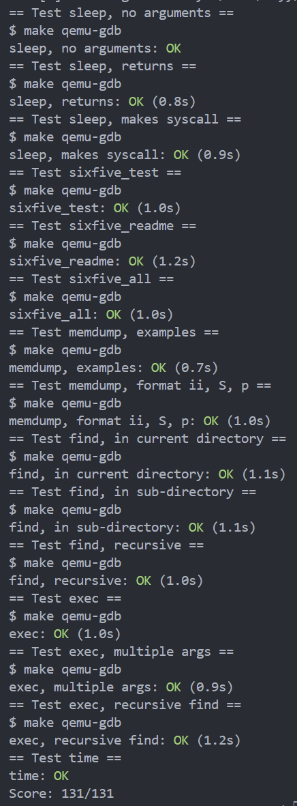
<br>图 3-4 util Lab 完整评分结果
</div>

### 3.9 本 Lab 心得

本 Lab 的代码量不大，但每个任务都对应一类基础能力：`sleep` 连接了用户程序与系统调用，`sixfive` 训练了基于字节流的状态解析，`memdump` 直接展示了类型在内存中的字节表示，`find` 和 `find -exec` 则把目录结构、递归、文件描述符和进程控制串联起来。

实验过程中最重要的方法是先核对当前版本的任务和评分脚本，再将功能拆成小检查点。每一项都经过“编译—手工样例—局部评分—Git 提交”，最后再做整体回归，因此出现问题时能够明确它属于哪个功能。这种节奏也为后续更复杂的内核 Lab 建立了可复用的开发和验收流程。

## 4. Lab syscall：System calls

### 4.1 实验概述

| 项目 | 内容 |
|---|---|
| 官方分支 | `syscall` |
| 实验主题 | 系统调用入口、进程级调用限制与内存隔离安全 |
| 具体任务 | GDB 调试、系统调用掩码 sandbox、路径例外、内存残留攻击 |
| 基线提交 | `0e53502` |
| 完成提交 | `f031d96` |
| 实际用时 | 5 小时 |
| 最终评分 | 45/45 |

本 Lab 从用户态 `ecall` 的入口开始，先借助 GDB 观察陷阱现场，再新增
`interpose()` 系统调用，将调用限制保存为进程状态并继承给子进程。随后将
单纯的系统调用屏蔽扩展为带路径例外的策略，最后利用未清零物理页泄露另一
进程的秘密数据，从防御和攻击两个方向理解系统调用边界。

### 4.2 Using gdb：跟踪系统调用与内核页错误

#### 4.2.1 系统调用链

用户程序并不能直接调用内核 C 函数。`user/usys.S` 中的桩函数把系统调用号
写入 `a7` 并执行 `ecall`；处理器进入 supervisor mode 后由 trampoline 保存
寄存器，`usertrap()` 识别用户态环境调用，最后进入 `syscall()` 完成分派：

```text
用户函数（如 open）
  → user/usys.S：a7 = SYS_open，执行 ecall
  → trampoline.S：保存用户寄存器
  → usertrap()
  → syscall()：读取 trapframe->a7
  → syscalls[a7]()
  → sys_open()
```

在 `syscall()` 设置断点后，backtrace 显示其直接调用者为 `usertrap()`。
首次命中断点时 `p->trapframe->a7 = 0xf`，对应 `SYS_open`，来自 init 打开
console 的操作。`sstatus = 0x200000022` 的 SPP 位为 0，说明陷阱发生前 CPU
运行在 user mode。

#### 4.2.2 页错误定位

按实验要求临时执行 `num = *(int *)0` 后，内核报告 `scause=0xd`、
`stval=0x0`，含义是读取地址 0 时发生 load page fault。根据 `sepc` 在
`kernel.asm` 中定位到 `lw a3, 0(zero)`，GDB 在同一地址断点也得到相同指令。
故障进程为 PID 1 的 init。原因是 xv6 内核页表没有映射虚拟地址 0，而不是
系统调用数组本身发生越界。

<div align="center">
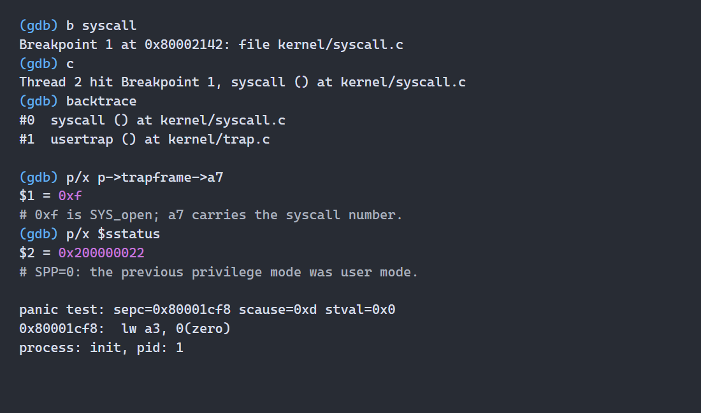
<br>图 4-1 GDB 中的系统调用调用栈、特权级与空地址页错误定位
</div>

调试完成后恢复 `kernel/syscall.c`，没有把故意制造 panic 的代码带入最终提交。
六个问题的完整观察结果记录在 `answers-syscall.txt` 中。

### 4.3 Sandbox a command：按掩码限制系统调用

#### 4.3.1 接口与状态设计

新增系统调用接口为：

```c
int interpose(int mask, const char *allowed_path);
```

`mask` 的第 `n` 位控制编号为 `n` 的系统调用。若该位为 1，调用默认被拒绝并
向用户态返回 `-1`。为了打通完整调用链，分别修改了以下位置：

| 文件 | 修改内容 | 作用 |
|---|---|---|
| `user/user.h` | 声明 `interpose()` | 允许用户程序编译调用 |
| `user/usys.pl` | 生成用户态调用桩 | 写入调用号并执行 `ecall` |
| `kernel/syscall.h` | 定义 `SYS_interpose = 22` | 分配唯一系统调用号 |
| `kernel/syscall.c` | 注册处理函数并检查掩码 | 在真正分派前拒绝调用 |
| `kernel/sysproc.c` | 实现 `sys_interpose()` | 读取参数并写入进程状态 |
| `kernel/proc.h` | 增加掩码和允许路径 | 保存每个进程的策略 |
| `Makefile` | 加入 `_sandbox` | 将测试程序写入文件系统镜像 |

新进程在 `allocproc()` 中将策略初始化为空，避免复用 `struct proc` 时残留旧
限制。`kfork()` 将父进程的 `syscall_mask` 和 `allowed_path` 复制给子进程，
使限制不能通过 fork 后 exec 绕过。

#### 4.3.2 分派前拦截

`syscall()` 先验证调用号，再检查：

```c
if(p->syscall_mask & (1U << num)) {
  p->trapframe->a0 = -1;
  return;
}
```

拦截放在 `syscalls[num]()` 之前，因此被禁止的内核服务不会产生部分副作用。
例如 `32768 = 1 << SYS_open`，执行 `sandbox 32768 - cat README` 时，cat 的
`open()` 立即返回失败，输出 `cat: cannot open README`。

### 4.4 Sandbox with allowed pathnames：精确路径例外

第二阶段允许被掩码限制的 `open` 和 `exec` 在路径完全匹配时继续执行。
`sys_interpose()` 使用 `argstr()` 将路径复制到进程私有的 `MAXPATH` 缓冲区；
分派时只对 `SYS_open`、`SYS_exec` 读取第 0 个参数，并用 `strncmp()` 与保存值
比较。其他被掩码覆盖的系统调用仍直接失败。

```text
调用被 mask 命中
  ├─ 不是 open/exec → 拒绝
  └─ 是 open/exec
       ├─ 参数提取失败或路径不相等 → 拒绝
       └─ 路径完全相等 → 正常分派
```

<div align="center">
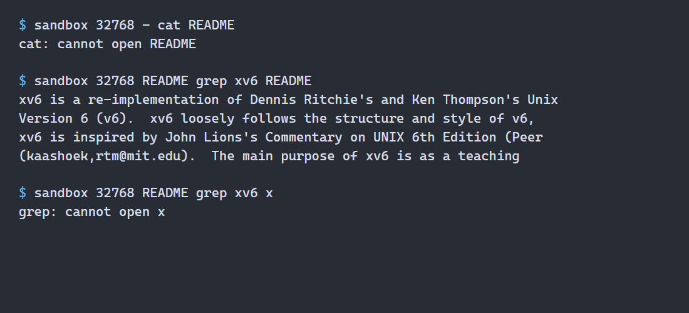
<br>图 4-2 sandbox 对 open 的拒绝、README 路径例外和非匹配路径拒绝
</div>

图 4-2 中同为被限制的 `open()`：`README` 与允许路径相同，grep 可以读取；
`x` 不匹配，因而仍返回失败。路径 `"-"` 不会匹配正常文件名，兼容第一阶段
“全部拒绝”的语义。

### 4.5 Attack xv6：利用未清零物理页

#### 4.5.1 漏洞原理

本 Lab 编译时通过 `LAB_SYSCALL` 故意跳过 `kalloc()`、`kfree()` 和
`uvmalloc()` 中的内存填充/清零。`secret` 进程在 8 页全局数组开头写入
`"This may help."`，并在偏移 16 字节处保存参数；进程退出后这些物理页被
放回 freelist，但原字节仍然存在。后续进程申请到同一页时即可读取前一进程
的数据，破坏进程隔离。

#### 4.5.2 攻击实现

`attack` 使用 `sbrk()` 申请 32 页，逐字节搜索已知标记。匹配后从标记起始
地址加 16 字节处读取连续字母和数字，写到标准输出。评分器保证秘密只包含
大小写字母和数字，因此这一停止条件既避免越界，也不会吞入后续垃圾数据。

```text
secret 退出并释放页面
  → 页面回到 freelist，但内容未清零
  → attack 通过 sbrk 重新申请页面
  → 搜索固定标记 "This may help."
  → 读取 marker + 16 处的秘密
```

<div align="center">
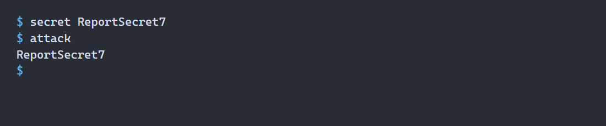
<br>图 4-3 attack 从重新分配的物理页中恢复 ReportSecret7
</div>

这个漏洞表明“程序功能仍能正常运行”不代表隔离是安全的。真实内核必须在将
物理页交给不同安全域前清除旧内容；仅依赖用户进程不会主动扫描内存是不成立
的安全假设。

### 4.6 问题闭环与最终验收

| 问题/风险 | 根本原因 | 处理方法 | 验证结果 |
|---|---|---|---|
| 只实现内核函数仍无法调用 | 系统调用需用户桩、调用号、分派表和实现共同组成 | 逐层补齐调用链 | 编译通过，`sandbox_mask` 通过 |
| 子进程可能绕过限制 | fork 默认只复制地址空间和通用进程状态 | 在 `kfork()` 显式复制策略 | `sandbox_fork: OK` |
| 路径例外误放行其他调用 | 仅凭掩码无法表达参数条件 | 只对 open/exec 提取并精确比较第 0 参数 | path、most、minus 均通过 |
| 攻击偶尔拿不到目标页 | freelist 顺序和先前分配会影响重用位置 | 一次申请 32 页并全范围搜索标记 | 随机秘密测试通过 |

关键提交如下：

| 提交 | 内容 |
|---|---|
| `1c298e3` | 完成 GDB 问题与 `answers-syscall.txt` |
| `ee2117e` | 实现系统调用掩码 sandbox |
| `6cfe037` | 增加允许路径语义 |
| `346d204`、`f031d96` | 完成攻击程序、耗时和最终收尾 |

从干净状态运行 `make grade`，所有项目通过：

<div align="center">
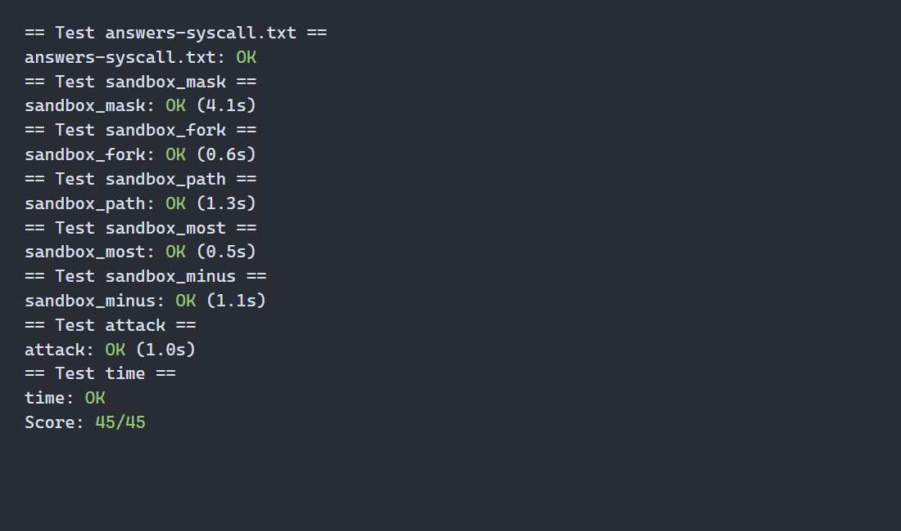
<br>图 4-4 syscall Lab 完整评分结果 45/45
</div>

本 Lab 将上一阶段“使用系统调用”推进到“设计和拦截系统调用”。最大的收获是
系统调用策略不仅是分派表中的一次判断，还必须覆盖进程初始化、fork 继承、
参数复制和错误返回等完整生命周期。攻击任务进一步说明内存管理中的清零操作
属于安全边界的一部分，而不是可随意删除的性能细节。

## 5. Lab pgtbl：Page tables

### 5.1 实验概述

| 项目 | 内容 |
|---|---|
| 官方分支 | `pgtbl` |
| 实验主题 | RISC-V Sv39 页表、地址转换、共享映射和大页 |
| 具体任务 | 解释进程页表、加速 getpid、递归打印页表、2 MiB superpage |
| 基线提交 | `cff452f` |
| 完成提交 | `364eff0` |
| 实际用时 | 7 小时 |
| 最终评分 | 41/41 |

本 Lab 围绕虚拟地址到物理地址的映射展开。先通过现有 `pgpte()` 观察用户进程
的叶子 PTE，再插入用户只读共享页；随后递归打印完整三级页表，最后把 level-1
叶子扩展为 2 MiB superpage，并处理 fork、退出和部分释放等生命周期问题。

### 5.2 Inspect a user-process page table：解释用户页表

#### 5.2.1 Sv39 地址结构与权限位

Sv39 把虚拟地址分为三级 9 位索引和 12 位页内偏移：

```text
  38             30 29             21 20             12 11          0
 +----------------+------------------+------------------+--------------+
 |     VPN[2]     |      VPN[1]      |      VPN[0]      | page offset  |
 +----------------+------------------+------------------+--------------+
```

每级页表含 512 个 64 位 PTE。有效非叶子 PTE 只设置 `V`，其物理页号指向下一
级页表；含 `R/W/X` 中任意一位的有效 PTE 是叶子映射。实验输出涉及的低位为：

| 位 | 含义 | 本实验中的用途 |
|---|---|---|
| `V` | Valid | PTE 是否有效 |
| `R/W/X` | 读、写、执行 | 页面允许的操作 |
| `U` | User | 用户态能否访问 |
| `A` | Accessed | 页面是否已被访问 |
| `D` | Dirty | 页面是否已被写入 |

#### 5.2.2 实际映射分析

`pgtbltest` 开头的有效页依次为两页用户只读可执行代码、数据/BSS、用户不可
访问的栈保护页和用户栈。高地址处依次预留 `USYSCALL`，并映射 supervisor
可访问的 trapframe 和 trampoline。普通堆区尚未增长的地址没有有效 PTE。

| 虚拟地址 | 权限 | 逻辑内容 |
|---|---|---|
| `0x0`、`0x1000` | `V|R|X|U|A` | 程序代码及只读数据 |
| `0x2000` | `V|R|W|U` | data 和 BSS |
| `0x3000` | `V|R|W` | 无 `U` 的栈保护页 |
| `0x4000` | `V|R|W|U|A|D` | 用户栈 |
| `0x3fffffd000` | 初始无映射，后为 `V|R|U` | USYSCALL 共享页 |
| `0x3fffffe000` | `V|R|W|A|D` | trapframe |
| `0x3ffffff000` | `V|R|X|A` | trampoline |

<div align="center">
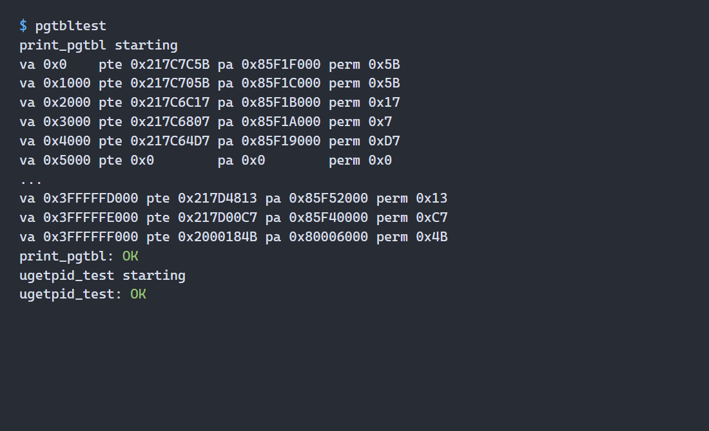
<br>图 5-1 pgtbltest 的典型叶子 PTE、权限与 ugetpid 测试结果
</div>

不同运行中的物理地址会变化且不连续，这是物理页分配顺序造成的正常现象；
判断页面用途应以虚拟地址、装载布局和权限位为依据。逐项解释保存在
`answers-pgtbl.txt` 中。

### 5.3 Speed up system calls：共享只读 USYSCALL 页

#### 5.3.1 设计目标

普通 `getpid()` 需要执行 `ecall` 并经历完整陷阱链。优化方案在每个进程的
`USYSCALL` 固定虚拟地址映射一页内核准备的数据，用户函数 `ugetpid()` 直接
读取页首的 `struct usyscall.pid`，避免用户态/内核态切换。

#### 5.3.2 页面生命周期

实现参照 trapframe 的管理方式，覆盖所有创建、失败回滚和释放路径：

```text
allocproc()
  → kalloc() 分配 usyscall 物理页
  → 写入当前进程 pid
  → proc_pagetable() 映射到 USYSCALL
  → 权限 PTE_R | PTE_U（不含 PTE_W）

freeproc()
  → proc_freepagetable() 解除 USYSCALL 映射
  → kfree() 归还物理页
```

`struct proc` 保存 `struct usyscall *usyscall`。每次 `allocproc()` 已经分配新的
PID，因此在创建页表前即可初始化共享内容；fork 创建子进程时自然得到独立页
和正确的子 PID。用户可读但不可写，避免伪造 `ugetpid()` 返回值。

同类方法还可优化 `uptime()`：内核维护一页全局 tick 计数，并把同一物理页
只读映射到各用户页表。若共享数据不能原子读取，则还需序列号等一致性协议。

### 5.4 Print a page table：递归打印三级映射

#### 5.4.1 遍历算法

`vmprint()` 先打印根页表地址，再从 level 2 开始扫描 512 个 PTE。无效项跳过；
有效项根据层级索引计算虚拟地址前缀，按深度输出 `" .."` 缩进。若 PTE 不含
`R/W/X`，它指向下一级页表并继续递归；叶子项只打印而不下降。

```c
uint64 pteva = va | ((uint64)i << PXSHIFT(level));
if(level > 0 && (pte & (PTE_R | PTE_W | PTE_X)) == 0)
  vmprintwalk((pagetable_t)PTE2PA(pte), level - 1,
              pteva, depth + 1);
```

所有地址和 PTE 使用 `%p` 输出完整 64 位十六进制值。第一次编译时 GCC 的
格式检查要求 `%p` 对应 `void *`，因此对数值做显式转换，既满足实验格式也
通过 `-Werror`。

<div align="center">
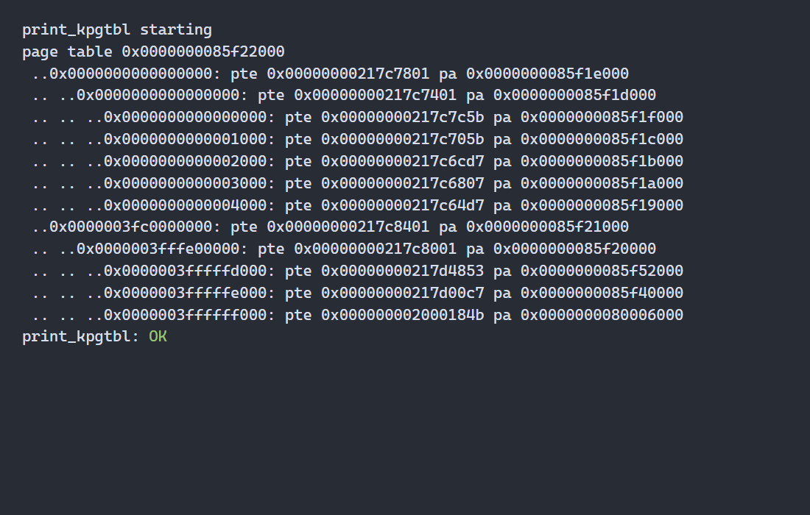
<br>图 5-2 vmprint 输出的三级页表树及高、低地址分支
</div>

图 5-2 中根页表有索引 0 和 255 两个有效分支；最深层叶子与图 5-1 的有效
页面一一对应。区别是 `print_pgtbl()` 只查询选定虚拟页并显示无效项，而
`vmprint()` 还显示指向下级页表的中间 PTE。

### 5.5 Use superpages：2 MiB 大页映射

#### 5.5.1 物理页分配器

2 MiB superpage 的物理地址必须 2 MiB 对齐。本实现从 `PHYSTOP` 以下预留
16 个连续对齐区域，共 32 MiB，建立独立的 `supermem.freelist` 和自旋锁。
普通 `freerange()` 只加入 `SUPERBASE` 以下的 4 KiB 页，从根本上避免同一物理
内存同时出现在两种 freelist 中。

`superalloc()` 和 `superfree()` 每次取出或归还一个完整 2 MiB 区域，并保留
xv6 用填充值发现悬空引用的习惯。16 个区域可以覆盖测试中父子进程同时持有的
superpage，同时为普通页、页表和内核对象保留足够内存。

#### 5.5.2 映射与地址转换

`uvmalloc()` 遍历新增范围时，只有虚拟地址 2 MiB 对齐且剩余长度至少 2 MiB
才调用 `superalloc()`。`supermappage()` 在 level-1 PTE 直接设置物理页号及
`V|R|W|U`，不再创建 level-0 页表，因而一个 PTE 代替 512 个普通页 PTE。

原 `walk()` 默认叶子只在 level 0。实现将其重构为能返回叶子层级的
`walkleaf()`；`walkaddr()` 若遇到 level-1 叶子，还要加入虚拟地址在 2 MiB
范围内的偏移，否则内核对 superpage 内不同 4 KiB 子区的访问都会错误指向
同一物理起始页。

#### 5.5.3 fork、释放与降级

| 生命周期操作 | 处理方式 |
|---|---|
| fork | `uvmcopy()` 为子进程分配新 2 MiB 区域，复制完整内容并保持 level-1 叶子 |
| 完整释放 | `uvmunmap()` 清除 level-1 PTE，调用 `superfree()` |
| 部分释放 | 先降级成 512 个独立 4 KiB 页，再精确释放目标页 |
| 退出 | `uvmfree()` 遍历地址空间，完整归还剩余 superpage |

部分释放是本任务的关键边界。如果 `sbrk(-PGSIZE)` 只删除 level-1 PTE，会把
仍应有效的约 2 MiB 数据一起丢失；如果继续保留大页，被释放的最后 4 KiB 又
仍可访问。`superdemote()` 因此先分配 level-0 页表和 512 个普通物理页，逐页
复制原内容并继承权限，成功后再归还原 superpage，最后按普通页路径解除目标
映射。分配失败时会释放已创建的小页并保留原映射，避免半降级状态。

<div align="center">
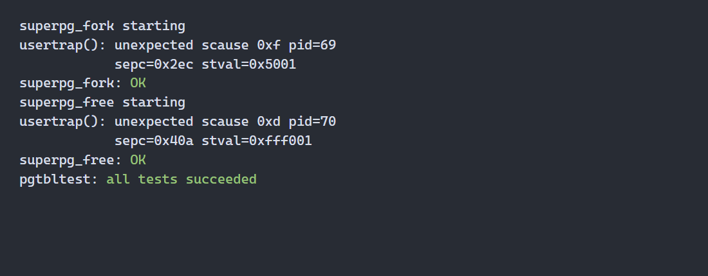
<br>图 5-3 superpage 在 fork、完整释放和部分降级场景下全部通过
</div>

图 5-3 的两次 `unexpected scause` 是测试子进程故意读取已经释放的地址；
子进程因页错误退出正是预期结果，所以其后的 `superpg_fork` 和
`superpg_free` 均为 `OK`。

### 5.6 问题闭环与最终验收

| 问题/风险 | 根本原因 | 处理方法 | 验证结果 |
|---|---|---|---|
| `ugetpid` 初始触发 load page fault | `USYSCALL` 只有地址定义，没有实际映射 | 补齐分配、只读映射、回滚和释放 | 64 次 fork 对比 PID 全部通过 |
| `%p` 导致编译失败 | `-Werror` 要求参数类型为指针 | 将 VA、PTE、PA 显式转为 `void *` | vmprint 格式评分通过 |
| superpage 内核地址翻译错误风险 | level-1 PTE 给出 2 MiB 基址，不能忽略页内偏移 | `walkleaf()` 返回层级，`walkaddr()` 加偏移 | 数据写入/读取检查通过 |
| 释放 4 KiB 可能破坏整张大页 | level-1 PTE 无法表达局部无效 | 降级为 512 个普通页后再释放 | 内容保持和无效 PTE 检查通过 |
| fork 后大页退化或共享 | 普通 `uvmcopy()` 只复制 4 KiB | 独立分配并复制完整 2 MiB | `superpg_fork: OK` |

关键提交如下：

| 提交 | 内容 |
|---|---|
| `6097a95` | 完成用户页表逐项解释 |
| `781903e` | 映射 USYSCALL 并加速 getpid |
| `d8c29ac` | 实现递归 vmprint |
| `b7b1643` | 实现 superpage 分配、复制、释放和降级 |
| `364eff0` | 记录 7 小时实际用时并完成验收 |

先运行 `pgtbltest` 验证页表结构和 superpage，再执行完整评分：

<div align="center">
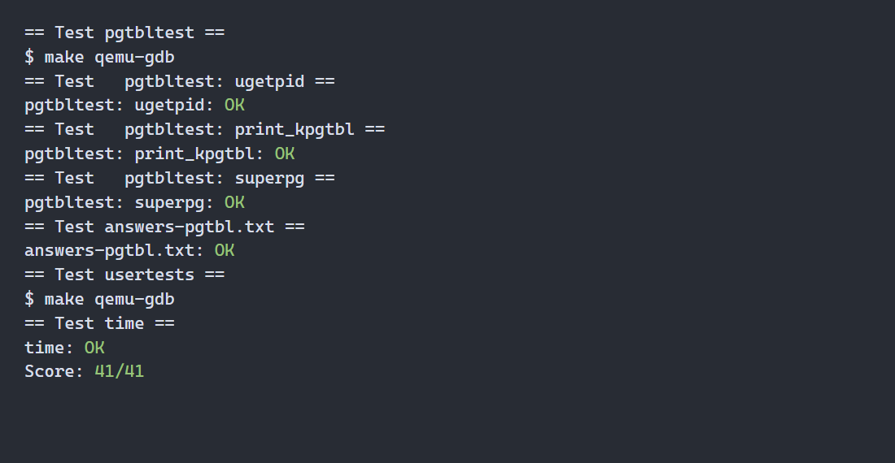
<br>图 5-4 pgtbl Lab 完整评分结果 41/41
</div>

`make grade` 中 `ugetpid`、`print_kpgtbl`、`superpg`、答案、`usertests` 和耗时
检查全部通过，最终为 **41/41**。本 Lab 的主要收获是页表修改不能只考虑
“建立一个 PTE”，还必须保持地址翻译、权限、fork、收缩、退出和失败回滚的
一致性。superpage 的代码量相对有限，但部分释放揭示了内存管理中粒度变化所
带来的复杂资源生命周期。

## 6. Lab traps：Traps

### 6.1 实验概述

| 项目 | 内容 |
|---|---|
| 官方分支 | `traps` |
| 实验主题 | RISC-V 汇编、内核栈、陷阱帧和时钟中断 |
| 具体任务 | RISC-V assembly、Backtrace、Alarm |
| 基线提交 | `4270ccc` |
| 完成提交 | `895895c` |
| 实际用时 | 5 小时 |
| 最终评分 | 95/95 |

本 Lab 从静态反汇编逐步进入运行时陷阱处理。首先分析 RISC-V 调用约定、编译器
内联和大小端表示；随后沿内核栈帧恢复系统调用的调用链；最后增加两个系统调用，
利用时钟中断把用户进程临时重定向到 alarm handler，并在处理结束后完整恢复现场。

### 6.2 RISC-V assembly：调用约定与反汇编分析

#### 6.2.1 参数传递与编译优化

RISC-V 使用 `a0` 至 `a7` 传递前八个整数或指针参数。`main()` 调用 `printf()`
时，`a0` 保存格式字符串地址，`a1=12`，`a2=13`。其中 `f(8)+1` 没有产生函数
调用：编译器先内联 `f()`，再把结果常量折叠为 12；`g()` 同样被内联为一条
执行 `x+3` 的 `addiw` 指令。

当前工具链生成的 `user/call.asm` 中，`printf` 位于 `0x6f6`，调用指令位于
`0x30`。RISC-V 的 `jal` 把下一条指令地址写入 `ra`，因此进入 `printf` 后
`ra=0x34`。

#### 6.2.2 大小端与未定义行为

整数 `0x00646c72` 在小端机器中的内存字节依次为 `72 6c 64 00`，解释为字符串
`"rld"`，所以程序输出 `He110 World`。若改为大端机器且仍要得到相同字符串，
整数应改为 `0x726c6400`；十进制数 57616 不需要修改，因为 `%x` 格式化的是
数值而不是内存字节序列。

当格式串要求两个整数而调用者只提供一个时，第二个值没有确定答案。`printf`
会读取未提供的参数位置，程序属于未定义行为，不能把某次运行中偶然出现的数值
写成语言或 ABI 保证的结果。

<div align="center">
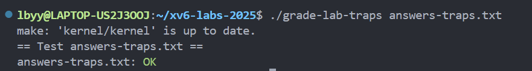
<br>图 6-1 RISC-V 汇编分析答案通过专项检查
</div>

### 6.3 Backtrace：遍历内核栈帧

#### 6.3.1 栈帧布局与边界

编译参数保留了帧指针。RISC-V 内核函数进入后，`s0` 指向当前栈帧顶部，
`s0-8` 保存返回地址，`s0-16` 保存上一帧的帧指针。因此回溯过程可表示为：

```text
r_fp() 读取 s0
  → *(fp - 8) 取得当前返回地址
  → *(fp - 16) 取得调用者 fp
  → 重复，直到离开当前 4 KiB 内核栈页
```

在 `kernel/riscv.h` 中用内联汇编 `mv` 读取 `s0`，在 `kernel/printf.c` 中实现
`backtrace()`。初始 `fp` 向下取整得到当前内核栈页下界，并以上界
`stack_bottom + PGSIZE` 限制遍历；同时要求 `fp` 至少高于页底 16 字节，保证
读取返回地址和上一帧指针不会跨入 guard page。

#### 6.3.2 调用链验证

`sys_pause()` 调用 `backtrace()` 后，`bttest` 打印三个返回地址。使用
`riscv64-linux-gnu-addr2line -e kernel/kernel` 解析后得到：

| 返回地址 | 源码位置 | 含义 |
|---|---|---|
| `0x80001e3e` | `kernel/sysproc.c:75` | `sys_pause()` 调用点 |
| `0x80001d18` | `kernel/syscall.c:141` | 系统调用分派 |
| `0x80001a9c` | `kernel/trap.c:80` | 用户陷阱入口 |

<div align="center">
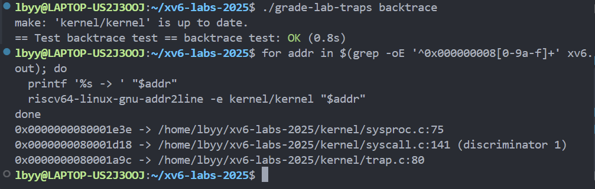
<br>图 6-2 Backtrace 专项评分及三个返回地址的源码定位
</div>

该结果同时验证了栈遍历格式和真实调用链。实现中 `%p` 的参数显式转换为
`void *`，满足内核 `printf` 的格式检查并保持 64 位地址完整输出。

### 6.4 Alarm：由时钟中断进入用户处理函数

#### 6.4.1 系统调用与进程状态

实验新增 `sigalarm(interval, handler)` 和 `sigreturn()`，分配系统调用号 22、
23，并补齐用户声明、调用桩、内核分派表和处理函数。`struct proc` 保存：

| 字段 | 作用 |
|---|---|
| `alarm_interval` | 两次 alarm 之间需要经过的 timer ticks |
| `alarm_ticks` | 当前周期已经累计的 ticks |
| `alarm_handler` | 用户处理函数入口地址 |
| `alarm_active` | handler 是否正在运行，防止重入 |
| `alarm_trapframe` | handler 执行前的完整用户寄存器现场 |

`sigalarm()` 更新配置并重新计时。进程退出或结构被复用时清空 alarm 状态；fork
复制父进程的周期和 handler，但子进程从未激活、计数为零的状态开始，避免继承
一半执行中的 handler 现场。

#### 6.4.2 中断触发与现场恢复

`usertrap()` 识别到 timer interrupt 后累计当前进程的 ticks。当累计值达到周期
且 `alarm_active` 为 0 时，内核先复制整个 trapframe，再把返回用户态所用的
`epc` 改为 handler 地址：

```c
p->alarm_trapframe = *(p->trapframe);
p->trapframe->epc = p->alarm_handler;
```

于是 `prepare_return()` 不再回到被中断指令，而是首次进入用户 handler。
handler 调用 `sigreturn()` 后，内核恢复保存的完整 trapframe 并清除 active
标记，使原程序从被中断位置继续执行。

完整恢复比只恢复 `epc` 更重要：时钟中断可能发生在任意用户指令之间，通用
寄存器、栈指针和参数寄存器都属于被中断程序的现场。`sys_sigreturn()` 还先
保存原 trapframe 中的 `a0` 并将其作为系统调用返回值，否则统一系统调用分派
代码会把新的返回值再次写入 `a0`，覆盖刚恢复的原始寄存器。

`alarm_active` 防止 handler 自身运行时间超过一个周期时再次进入 handler；
只有显式执行 `sigreturn()` 后，下一次 alarm 才能被投递。

<div align="center">
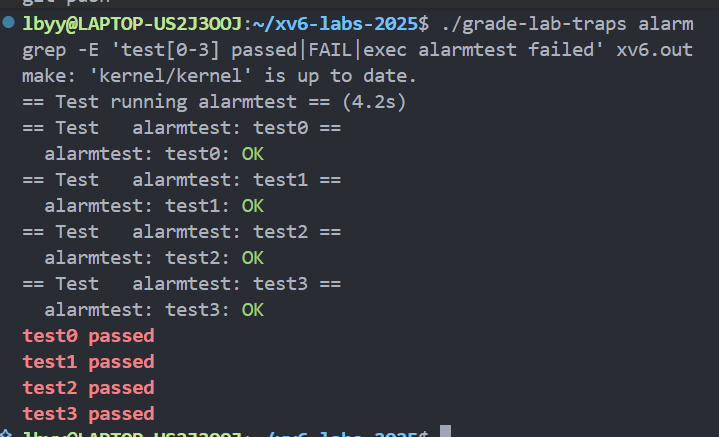
<br>图 6-3 Alarm 的单次/重复触发、寄存器恢复、防重入和 a0 保持测试
</div>

### 6.5 问题闭环与最终验收

| 问题/风险 | 根本原因 | 处理方法 | 验证结果 |
|---|---|---|---|
| `%p` 引起 `-Werror=format` | 内核格式属性要求 `%p` 对应指针参数 | 将返回地址显式转换为 `void *` | Backtrace 编译及评分通过 |
| `exec alarmtest failed` | 新程序尚未写入当前 `fs.img`，且初始 Makefile 未加入目标 | 将 `_alarmtest` 加入 traps 的 `UPROGS` 并重建镜像 | `alarmtest` 可执行，四项均通过 |
| handler 可能周期性重入 | 时钟中断在 handler 运行期间仍会发生 | 使用 `alarm_active` 门控，`sigreturn()` 后解除 | test2 通过 |
| 原程序寄存器可能被破坏 | 只改 `epc` 无法保存任意中断点的完整状态 | 备份并恢复整个 trapframe，保护原始 `a0` | test1、test3 通过 |

关键提交如下：

| 提交 | 内容 |
|---|---|
| `c572d63` | 完成 RISC-V 汇编分析题 |
| `59b7b78` | 实现内核栈 Backtrace |
| `5abddb9` | 接入 Alarm 系统调用并处理时钟中断 |
| `895895c` | 记录 5 小时实际用时并完成验收 |

从干净状态运行 `make grade`，汇编答案、Backtrace、Alarm 的 test0 至 test3、
`usertests` 和时间检查全部通过：

<div align="center">
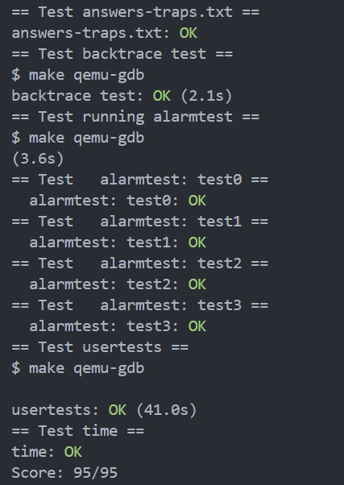
<br>图 6-4 traps Lab 完整评分结果 95/95
</div>

本 Lab 把静态 ABI 知识与动态控制流联系起来：函数调用依赖寄存器和栈帧约定，
系统调用通过 trapframe 保存跨特权级现场，而异步 alarm 又要求内核在未知指令
边界上完整保存并恢复用户状态。最大的收获是，中断处理的正确性不仅取决于
“能跳到 handler”，更取决于恢复后程序是否像从未被打断一样继续运行。

## 7. Lab cow：Copy-on-write

### 7.1 实验概述

| 官方分支 | 主题 | 具体任务 |
|---|---|---|
| `cow` | 页错误、物理页引用计数与写时复制 | 待按 2025 版填写 |

### 7.2 任务一：待填写官方任务名

#### 7.2.1 实验目的

待填写。

#### 7.2.2 前期准备、相关原理与调用链

待填写 fork、页表权限、页错误和物理页生命周期。

#### 7.2.3 设计与实现步骤

待填写。

#### 7.2.4 实验结果

待填写手工测试、压力测试和局部评分。

#### 7.2.5 分析讨论

待填写引用计数、并发安全和异常路径。

### 7.3 问题与解决、心得及验收

待记录问题闭环、`make grade` 结果、截图和 commit。

## 8. Lab net：Network driver

### 8.1 实验概述

| 官方分支 | 主题 | 具体任务 |
|---|---|---|
| `net` | 网卡驱动、描述符环、中断和并发 | 待按 2025 版填写 |

### 8.2 任务一：待填写官方任务名

#### 8.2.1 实验目的

待填写。

#### 8.2.2 前期准备、相关原理与调用链

待填写发送/接收描述符、DMA 和中断处理链。

#### 8.2.3 设计与实现步骤

待填写。

#### 8.2.4 实验结果

待填写数据包测试、局部评分和必要截图。

#### 8.2.5 分析讨论

待填写环形队列不变式、资源回收和并发安全。

### 8.3 问题与解决、心得及验收

待记录问题闭环、`make grade` 结果、截图和 commit。

## 9. Lab lock：Locking

### 9.1 实验概述

| 官方分支 | 主题 | 具体任务 |
|---|---|---|
| `lock` | 自旋锁、并行性和锁竞争 | 待按 2025 版填写 |

### 9.2 任务一：待填写官方任务名

#### 9.2.1 实验目的

待填写。

#### 9.2.2 前期准备、相关原理与调用链

待填写共享状态、锁保护不变式和竞争来源。

#### 9.2.3 设计与实现步骤

待填写。

#### 9.2.4 实验结果

待填写正确性、竞争统计和多核结果。

#### 9.2.5 分析讨论

待填写拆锁后的并行性、正确性与性能权衡。

### 9.3 其他任务

待按 9.2 的统一结构补齐。

### 9.4 问题与解决、心得及验收

待记录问题闭环、默认多核 `make grade` 结果、截图和 commit。

## 10. Lab fs：File system

### 10.1 实验概述

| 官方分支 | 主题 | 具体任务 |
|---|---|---|
| `fs` | inode、块分配、目录和文件系统 | 待按 2025 版填写 |

### 10.2 任务一：待填写官方任务名

#### 10.2.1 实验目的

待填写。

#### 10.2.2 前期准备、相关原理与调用链

待填写 inode、块映射、日志与文件操作链。

#### 10.2.3 设计与实现步骤

待填写。

#### 10.2.4 实验结果

待填写功能测试、大文件/路径边界和局部评分。

#### 10.2.5 分析讨论

待填写块索引、锁、引用和异常路径中的资源释放。

### 10.3 其他任务

待按 10.2 的统一结构补齐。

### 10.4 问题与解决、心得及验收

待记录问题闭环、`make grade` 结果、截图和 commit。

## 11. Lab mmap：Memory mapping

### 11.1 实验概述

| 官方分支 | 主题 | 具体任务 |
|---|---|---|
| `mmap` | 文件映射、虚拟内存区域和页错误 | 待按 2025 版填写 |

### 11.2 任务一：待填写官方任务名

#### 11.2.1 实验目的

待填写。

#### 11.2.2 前期准备、相关原理与调用链

待填写映射区域、延迟分配、页错误和文件生命周期。

#### 11.2.3 设计与实现步骤

待填写。

#### 11.2.4 实验结果

待填写读写、解映射、进程退出和局部评分结果。

#### 11.2.5 分析讨论

待填写映射语义、权限、边界和资源回收。

### 11.3 问题与解决、心得及验收

待记录问题闭环、`make grade` 结果、截图和 commit。

## 12. 综合分析

### 12.1 系统调用的完整链路

util Lab 从用户程序一侧调用 `pause`、`open`、`read`、`fork` 和 `exec`；syscall
Lab 则补齐了另一侧的入口和分派过程。完整链路为：用户 C 函数调用由
`usys.pl` 生成的汇编桩，桩函数把调用号写入 `a7` 后执行 `ecall`；硬件切换
特权级，trampoline 保存寄存器，`usertrap()` 进入 `syscall()`；分派器根据
`trapframe->a7` 查表调用 `sys_*` 实现，并把返回值写回 `a0`。新增
`interpose()` 证明扩展系统调用必须同时修改声明、桩、编号、分派和内核实现，
而 sandbox 还说明系统调用策略属于进程状态，必须随 fork 正确继承。

### 12.2 进程、陷阱与虚拟内存的关系

当前完成的 syscall 和 pgtbl Lab 已展示三者的基本关系：进程通过 `struct proc`
持有独立页表和 trapframe；用户态执行 `ecall` 或发生页错误时，硬件进入
supervisor mode，trampoline 利用高地址处的 trapframe 映射保存上下文；内核
处理完成后恢复用户页表和寄存器。`USYSCALL` 表明同一进程页表可同时包含普通
用户页、用户只读的内核共享数据以及仅 supervisor 可访问的 trapframe 与
trampoline。后续 traps、COW 和 mmap Lab 完成后再补充异常修复、共享物理页
和延迟映射部分。

### 12.3 并发、锁与资源生命周期

待综合 net、lock 和 fs 填写。

### 12.4 各 Lab 之间的联系

前四个已完成 Lab 构成一条逐层深入的路径：util 在用户态组合系统调用实现命令；
syscall 进入内核观察调用分派、策略控制和隔离漏洞；pgtbl 继续下降到支撑进程
隔离的地址转换和物理页生命周期。`attack` 能泄露秘密的根因正是物理页重用时
没有清零，而 pgtbl Lab 的 `kalloc`、`uvmalloc`、`uvmcopy` 和 `uvmunmap`
进一步展示了这些页面如何分配、映射、复制和回收。traps 则解释了用户程序如何
经 `ecall` 和 trapframe 穿过特权级边界，并通过 Backtrace 与 Alarm 分别观察
同步系统调用链和异步时钟中断下的控制流保存与恢复。

## 13. 总结与心得

<!-- 只总结真实完成的内容、理解上的变化和后续改进方向。 -->

待填写。

## 14. 参考资料

1. MIT 6.1810 Fall 2025 Course Website: <https://pdos.csail.mit.edu/6.828/2025/>
2. MIT 6.1810 Tools: <https://pdos.csail.mit.edu/6.828/2025/tools.html>
3. MIT 6.1810 Lab Guidance: <https://pdos.csail.mit.edu/6.828/2025/labs/guidance.html>
4. MIT 6.1810 Lab: Xv6 and Unix utilities: <https://pdos.csail.mit.edu/6.828/2025/labs/util.html>
5. MIT 6.1810 Lab: System calls: <https://pdos.csail.mit.edu/6.828/2025/labs/syscall.html>
6. MIT 6.1810 Lab: Page tables: <https://pdos.csail.mit.edu/6.828/2025/labs/pgtbl.html>
7. MIT 6.1810 Lab: Traps: <https://pdos.csail.mit.edu/6.828/2025/labs/traps.html>
8. Russ Cox, Frans Kaashoek, Robert Morris. *xv6: a simple, Unix-like teaching operating system*.
9. RISC-V International. *The RISC-V Instruction Set Manual, Volume II: Privileged Architecture*.

<!-- 参考同学报告时只借鉴结构；若最终正文实际引用了其观点，必须在此显式标注。 -->

## 15. 源码仓库与提交记录

- 源码仓库：<https://github.com/lbyy718/xv6-labs-2025>
- 官方基线远程：`mit`
- 个人仓库远程：`origin`
- 各 Lab 使用同名分支保存实现。

| Lab | 分支 | 关键提交 | 最终评分 |
|---|---|---|---|
| util | `util` | `6bff0db`、`10d4cfd`、`52d4487`、`c28178d`、`5493306` | 131/131 |
| syscall | `syscall` | `1c298e3`、`ee2117e`、`6cfe037`、`346d204`、`f031d96` | 45/45 |
| pgtbl | `pgtbl` | `6097a95`、`781903e`、`d8c29ac`、`b7b1643`、`364eff0` | 41/41 |
| traps | `traps` | `c572d63`、`59b7b78`、`5abddb9`、`895895c` | 95/95 |
| cow | `cow` | 待填写 | 待填写 |
| net | `net` | 待填写 | 待填写 |
| lock | `lock` | 待填写 | 待填写 |
| fs | `fs` | 待填写 | 待填写 |
| mmap | `mmap` | 待填写 | 待填写 |

## 附录

### 附录 A：完整评分结果

| Lab | 命令 | 结果 | 证据 |
|---|---|---|---|
| util | `make clean && make grade` | 131/131 | 图 3-4 |
| syscall | `make grade` | 45/45 | 图 4-4 |
| pgtbl | `make grade` | 41/41 | 图 5-4 |
| traps | `make grade` | 95/95 | 图 6-4 |

其余 Lab 完成后继续补充。

### 附录 B：报告图片索引

| 图片 | 所属章节 | 说明 |
|---|---|---|
| `report-assets/util-sixfive-01.png` | 3.3 | sixfive 多文件处理结果 |
| `report-assets/util-memdump-01.png` | 3.4 | memdump 内置五组示例 |
| `report-assets/util-find-exec-grade-01.png` | 3.6 | find 与 find -exec 六项回归评分 |
| `report-assets/util-grade-final-01.png` | 3.8 | util 完整评分 131/131 |
| `report-assets/syscall-gdb-01.png` | 4.2 | GDB 系统调用现场与页错误定位 |
| `report-assets/syscall-sandbox-01.png` | 4.4 | sandbox 掩码和路径例外测试 |
| `report-assets/syscall-attack-01.png` | 4.5 | attack 恢复 secret 数据 |
| `report-assets/syscall-grade-01.png` | 4.6 | syscall 完整评分 45/45 |
| `report-assets/pgtbl-inspect-01.png` | 5.2 | 用户页表权限和 ugetpid 测试 |
| `report-assets/pgtbl-vmprint-01.png` | 5.4 | vmprint 三级页表树 |
| `report-assets/pgtbl-superpages-01.png` | 5.5 | superpage fork、释放和降级测试 |
| `report-assets/pgtbl-grade-01.png` | 5.6 | pgtbl 完整评分 41/41 |
| `report-assets/traps-assembly-grade-01.png` | 6.2 | RISC-V 汇编答案专项评分 |
| `report-assets/traps-backtrace-grade-01.png` | 6.3 | Backtrace 评分和返回地址解析 |
| `report-assets/traps-alarm-grade-01.png` | 6.4 | Alarm 四项测试及实际输出 |
| `report-assets/traps-grade-final-01.png` | 6.5 | traps 完整评分 95/95 |

### 附录 C：答辩演示命令

syscall Lab：

```bash
git switch syscall
make qemu
```

```text
sandbox 32768 - cat README
sandbox 32768 README grep xv6 README
secret ReportSecret7
attack
```

pgtbl Lab：

```bash
git switch pgtbl
make qemu
```

```text
pgtbltest
```

traps Lab：

```bash
git switch traps
./grade-lab-traps backtrace
grep -oE '^0x000000008[0-9a-f]+' xv6.out | while read -r addr; do
  printf '%s -> ' "$addr"
  riscv64-linux-gnu-addr2line -e kernel/kernel "$addr"
done
./grade-lab-traps alarm
```

预期分别看到 sandbox 的拒绝/例外行为、`attack` 输出秘密，以及
`pgtbltest: all tests succeeded`；traps 演示应看到三层内核调用链及 Alarm 的
test0 至 test3 全部为 `OK`。退出 QEMU 时先按 `Ctrl+A`，再按 `X`。
